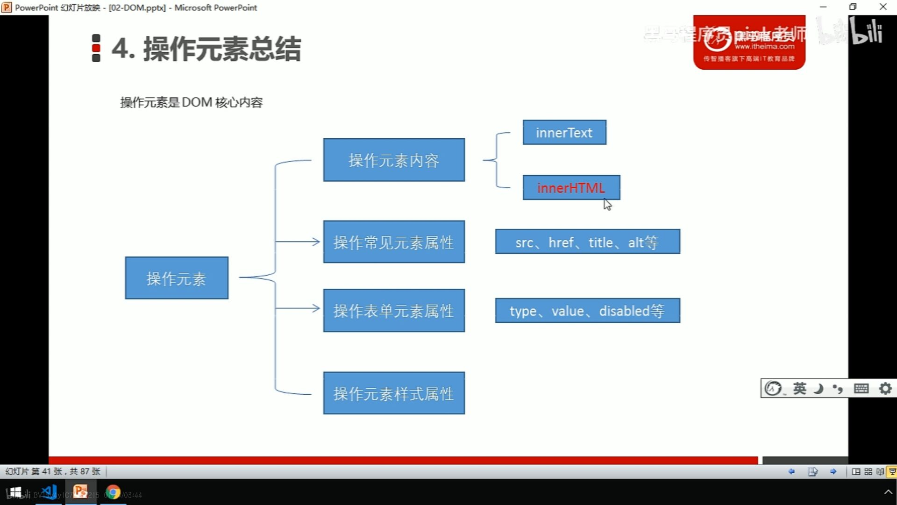

# [位图算法：什么是BitMap ](https://www.cnblogs.com/54chensongxia/p/11591979.html)

## BitMap的开源实现[#](https://www.cnblogs.com/54chensongxia/p/11591979.html#2-bitmap的开源实现)

BitMap算法的开源实现由**JDK的BitSet和谷歌的EWAHCompressedBitmap。**

BitSet是对BitMap算法的简单实现，而EWAHCompressedBitmap对BitMap的存储空间做了优化。

我们还是接着上面列子往下讲。上面我们已经在BitMap中插入了2和4两个数，现在数据中的数存储如下：

加入现在要插入一个非常大的数，比如10000000，那么BitMap必须要开启一大块空间来存储10000000，但是这篇空间中的很多Bit位是用不到的。在这种数据分布极度不均匀的情况下BitMap的空间利用率是很低的。EWAHCompressedBitmap实现就对这种情况作了优化。具体的优化算法这边就不做详细解释了。可以参考这篇[博客](https://mp.weixin.qq.com/s/xxauNrJY9HlVNvLrL5j2hg)

## 3. 使用案列[#](https://www.cnblogs.com/54chensongxia/p/11591979.html#3-使用案列)

- ###### 给定10亿个不重复的正int的整数，没排过序的，然后再给一个数，如何快速判断这个数是否在那10亿个数当中。

解法：遍历40个亿数字，映射到BitMap中，然后对于给出的数，直接判断指定的位上存在不存在即可。

- 使用位图法判断正整形数组是否存在重复

解法：遍历一遍，存在之后设置成1，每次放之前先判断是否存在，如果存在，就代表该元素重复。

- 使用位图法进行元素不重复的正整形数组排序

解法：遍历一遍，设置状态1，然后再次遍历，对状态等于1的进行输出，参考计数排序的原理。

- 在2.5亿个整数中找出不重复的正整数，注，内存不足以容纳这2.5亿个整数

解法1：采用2-Bitmap（每个数分配2bit，00表示不存在，01表示出现一次，10表示多次，11无意义）。

解法2：采用两个BitMap，即第一个Bitmap存储的是整数是否出现，接着，在之后的遍历先判断第一个BitMap里面是否出现过，如果出现就设置第二个BitMap对应的位置也为1，最后遍历BitMap，仅仅在一个BitMap中出现过的元素，就是不重复的整数。

解法3：分治+Hash取模，拆分成多个小文件，然后一个个文件读取，直到内存装的下，然后采用Hash+Count的方式判断即可。

该类问题的变形问题，如已知某个文件内包含一些电话号码，每个号码为8位数字，统计不同号码的个数。8位最多99 999 999，大概需要99m个bit，大概10几m字节的内存即可。 （可以理解为从0-99 999 999的数字，每个数字对应一个Bit位，所以只需要99M个Bit==12MBytes，这样，就用了小小的12M左右的内存表示了所有的8位数的电话）

**BitMap的一些缺点**：

（1）数据碰撞。比如将字符串映射到 BitMap 的时候会有碰撞的问题，那就可以考虑用 Bloom Filter 来解决，Bloom Filter 使用多个 Hash 函数来减少冲突的概率。

（2）数据稀疏。又比如要存入(10,8887983,93452134)这三个数据，我们需要建立一个 99999999 长度的 BitMap ，但是实际上只存了3个数据，这时候就有很大的空间浪费，碰到这种问题的话，可以通过引入 Roaring BitMap 来解决。

